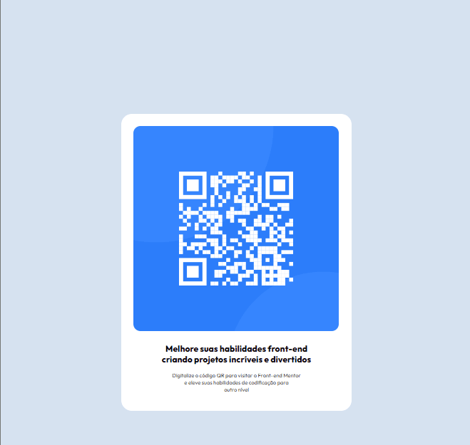

# Frontend Mentor - Solução do desafio do código QR

Esta é uma solução para o [desafio do componente de código QR no Frontend Mentor] (https://www.frontendmentor.io/challenges/qr-code-component-iux_sIO_H). Os desafios do Frontend Mentor ajudam-no a melhorar as suas capacidades de codificação através da construção de projectos realistas. 💻

## Índice 🗂️

- [Visão geral](#visão-geral)
  - [Captura do projeto](#captura-do-projeto)
  - [Links](#links)
- [O meu processo](#meu-processo)
  - [O meu processo](#meu-processo)
  - [Construído com](#construído-com)
  - [O que eu aprendi](#o-que-eu-aprendi)

- [Outros](#outros)

  - [Minhas redes sociais!](#minhas-redes-sociais)

## Visão geral

### Captura do projeto

[]

### Links

- URL do site ativo: [https://tales-santos7.github.io/Projeto-QRcode-FM/](https://tales-santos7.github.io/Projeto-QRcode-FM/)

## Meu processo 

Quando iniciei o desenvolvimento desse projeto front-end, tive a oportunidade de colocar em prática muitos dos conceitos que havia aprendido anteriormente. Isso significou que eu poderia sair da teoria e realmente entender como tudo se encaixa na construção de uma interface web.

Uma das primeiras etapas foi me familiarizar com a estrutura HTML da aplicação. Precisei entender a semântica e a organização dos elementos para criar uma base sólida. Em seguida, trabalhei no estilo visual utilizando CSS, explorando técnicas de layout, cores, tipografia e responsividade. 

Conforme o projeto avançava, precisei lidar com questões de performance e boas práticas de desenvolvimento. Isso me fez compreender a importância de criar interfaces inclusivas e eficientes.

No geral, essa jornada de desenvolvimento front-end me proporcionou um crescimento significativo. Pude consolidar conceitos fundamentais, desenvolver novas habilidades práticas e adquirir mais confiança para enfrentar futuros desafios de interface web.

### Construído com

 
- HTML5  
  - CSS 

### O que eu aprendi

Trabalhar nesse projeto de front-end me ajudou a compreender melhor alguns conceitos em que antes eu tinha dificuldade. 

Ao me envolver diretamente com esse projeto prático, eu tive a oportunidade de aplicar na prática conceitos como HTML, CSS, que são a base do desenvolvimento web. Isso me permitiu entender de forma mais profunda como esses elementos se integram para criar interfaces ricas e interativas.

Além disso, eu precisei lidar com desafios de designr e esponsividade, que são aspectos cruciais no desenvolvimento front-end moderno. Ao enfrentar esses desafios, pude aprimorar minhas habilidades de resolução de problemas, pensamento crítico e tomada de decisões.

## Outros

### Minhas redes sociais!

 
  
  

